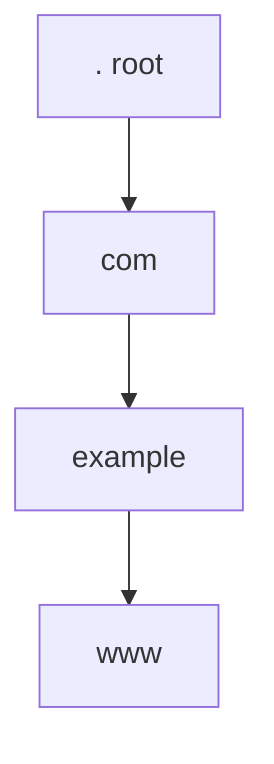
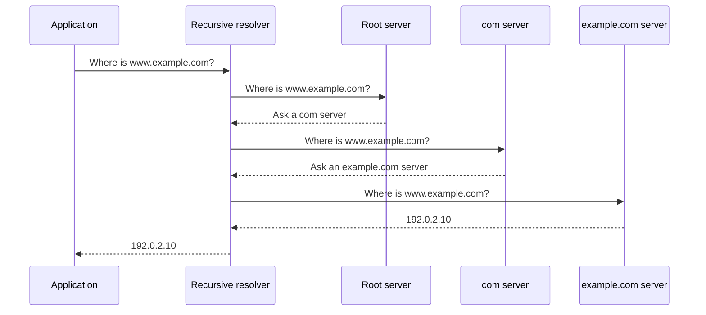

# What Problem Does DNS Solve?

Before writing a parser, we need a useful mental model. DNS is often summarized
as “the phone book of the Internet.” That metaphor helps for five minutes and
then becomes misleading. A phone book is one database in one place. DNS is a
distributed database whose ownership is split along a name hierarchy.

By the end of this chapter, you will be able to:

- separate a domain name, a zone, a server, and a resolver;
- trace the actors involved in an ordinary lookup;
- identify the question and answer in a DNS message;
- explain why caching is part of DNS correctness rather than an optimization;
- locate the corresponding concepts in RFC 1034.

No code is required yet. Our runnable victory is smaller: use an existing system
tool to observe the data our Scala program will eventually produce.

## Start from the application

Suppose a browser wants to connect to `www.example.com`. The network connection
needs an IP address, but the user supplied a name. The application asks a *stub
resolver*, usually through the operating system. The stub sends a DNS question
to a *recursive resolver* configured by the network or the user.

The question is not merely “what is this name?” It is a triple:

| Field | Example | Meaning |
|---|---|---|
| name | `www.example.com.` | owner name being queried |
| type | `A` | IPv4 address record |
| class | `IN` | Internet namespace |

The final dot means the name is absolute. It ends at the DNS root. User-facing
software often hides this dot, but the wire format always terminates a name.

## Meet the actors

Four roles matter throughout this book.

### Stub resolver

A small client used by an application or operating system. It normally sends a
question to one configured recursive resolver and expects that resolver to do
the hard work. `DnsClient` in this repository is a stub.

### Recursive resolver

A service that promises to find the final result. It uses cached information
when possible. Otherwise it asks other DNS servers, follows referrals, handles
aliases, and caches what it learns. Part 3 builds this policy.

### Authoritative server

A server that answers from data it is responsible for. It does not need to ask
the rest of the Internet for an in-zone answer. `Zone` is the beginning of this
side of the implementation; Part 4 puts it behind real sockets.

### Name server

A general term for a process answering DNS queries. A name server may provide
recursive service, authoritative service, or both. Do not infer policy merely
from the word “server.”

## Follow the hierarchy

Read `www.example.com.` from right to left:



Each piece is a *label*. A sequence of labels ending at the root is a domain
name. The root can delegate responsibility for `com.`; `com.` can delegate
`example.com.`. Delegation is what makes the database distributed.

This hierarchy does **not** imply that every label has a separate server or zone.
A zone is an administrative slice of the tree. It begins at an origin and may
contain many descendant names until another delegation cuts out a child zone.

This distinction prevents a common mistake:

```text
domain name: www.example.com.    identifies one node in the namespace
zone:        example.com.        administrative data served together
server:      ns1.example.net.    a host that may serve many zones
```

Read [RFC 1034 §3.1](https://www.rfc-editor.org/rfc/rfc1034#section-3.1) for the
name-space model and [RFC 1034 §4.2](https://www.rfc-editor.org/rfc/rfc1034#section-4.2)
for zones and administrative boundaries.

## Follow one uncached lookup

Assume a recursive resolver knows only root-server addresses.



A *referral* says, roughly, “I do not own the final answer, but these name
servers are closer to it.” *Glue* is address data included so the resolver can
reach those servers without creating an immediate circular dependency.

The server algorithm in
[RFC 1034 §4.3.2](https://www.rfc-editor.org/rfc/rfc1034#section-4.3.2) is worth
bookmarking. We will return to individual branches when implementing exact
answers, aliases, delegations, wildcard matches, and negative answers.

## Why caching changes the answer

Every resource record has a TTL: the number of seconds a result may remain in a
cache. After nine seconds, a record originally received with TTL 10 should be
served with approximately TTL 1, not TTL 10. At expiry it must be removed.

Caching serves three protocol goals:

1. It reduces latency for applications.
2. It prevents every lookup from reaching root and top-level-domain servers.
3. TTL lets data owners bound how long old data remains useful after a change.

Negative results are cached too. NXDOMAIN means that the queried name does not
exist; NODATA means that the name exists but has no record of the requested type.
Their caching rules are standardized by
[RFC 2308](https://www.rfc-editor.org/rfc/rfc2308).

## Observe DNS before implementing it

If `dig` is installed, run:

```console
dig example.com A
```

Find these pieces in the output:

- `opcode: QUERY` — this is a normal query operation;
- `status: NOERROR` — the request was processed without a DNS error;
- `id` — a 16-bit transaction identifier;
- `flags` — for example `qr`, `rd`, and `ra`;
- `QUESTION SECTION` — name, type, and class;
- `ANSWER SECTION` — typed records and TTLs.

Now request a type that is less likely to exist:

```console
dig example.com SRV
```

Compare an empty NOERROR answer with:

```console
dig does-not-exist.example.com A
```

The second response should be NXDOMAIN. Both may carry an SOA record in the
authority section so a resolver can cache the negative result.

Network access and answers vary, so the book does not use these commands as
automated tests. Later chapters use fixed byte fixtures and local servers for
reproducibility.

## Map the concepts to our Scala types

Do not study the implementation yet; just see that the vocabulary has a home:

| Concept | Scala type |
|---|---|
| absolute name | `DomainName` |
| question triple | `Question` |
| typed data | `RecordData` |
| record plus owner/class/TTL | `ResourceRecord` |
| four-section packet | `Message` |
| authoritative data/policy | `Zone` |
| expiring learned answers | `Cache` |
| stub network client | `DnsClient` |

This is colocation as a design rule. Name invariants live with `DomainName`.
TTL expiry lives with `Cache`. Wire boundaries live with `MessageCodec`. The
types are not a folder taxonomy; each one owns a protocol responsibility.

## Checkpoint

You should now be able to answer:

1. Why is a recursive resolver different from an authoritative server?
2. Why is `www.example.com.` not necessarily a zone?
3. What three fields form a question?
4. What is the difference between NXDOMAIN and an empty NOERROR response?
5. Why must a cached TTL decrease?

If any answer is unclear, reread only the relevant section. The next chapter
introduces bits, octets, unsigned integers, and network byte order. After that,
we will open a DNS packet and account for every one of its first twelve bytes.

## Primary references

- [RFC 1034 §2 — General model](https://www.rfc-editor.org/rfc/rfc1034#section-2)
- [RFC 1034 §3.1 — Name space](https://www.rfc-editor.org/rfc/rfc1034#section-3.1)
- [RFC 1034 §4.2 — Zones](https://www.rfc-editor.org/rfc/rfc1034#section-4.2)
- [RFC 1034 §4.3.2 — Server algorithm](https://www.rfc-editor.org/rfc/rfc1034#section-4.3.2)
- [RFC 1035 §4.1 — Message format](https://www.rfc-editor.org/rfc/rfc1035#section-4.1)
- [RFC 2308 — Negative caching](https://www.rfc-editor.org/rfc/rfc2308)
