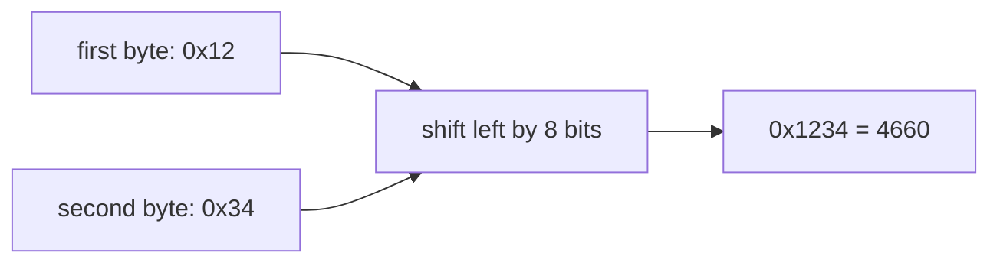
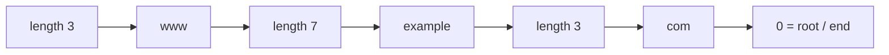

# Read Bytes Without Fear

DNS messages are not JSON or text. They are sequences of bytes. That sounds
specialized, but we only need four small ideas before opening a packet:

1. a byte can be shown as a number;
2. several bits can share one byte;
3. two bytes can form one larger number;
4. a length can tell us where the next value begins.

This chapter introduces those ideas from scratch. There is no networking yet.

## One byte is eight switches

A **bit** is one binary choice: `0` or `1`. A **byte** (also called an **octet**
in RFCs) contains eight bits.

```text
bit position     7   6   5   4   3   2   1   0
                 |   |   |   |   |   |   |   |
example byte     0   0   0   0   1   1   0   1
value            128 64  32  16  8   4   2   1
```

The example contains the values 8, 4, and 1, so it represents decimal 13.

Humans rarely write packet bytes as eight binary digits. We use
**hexadecimal**, a base-16 notation. One hexadecimal digit represents four bits,
so exactly two hexadecimal digits represent one byte.

| Binary | Hex | Decimal |
|---:|---:|---:|
| `0000` | `0` | 0 |
| `0001` | `1` | 1 |
| `1001` | `9` | 9 |
| `1010` | `a` | 10 |
| `1111` | `f` | 15 |

Our example is `0000 1101`, written as `0d` in hexadecimal.

## Why packet dumps use hexadecimal

Compare three ways to show the same four bytes:

```text
binary:   00010010 00110100 00000001 00000000
decimal:  18       52       1        0
hex:      12       34       01       00
```

Hexadecimal is compact but keeps byte boundaries visible. Throughout the book,
spaces separate bytes. `12 34` means two bytes, not the decimal number 1,234.

## Two bytes can form one number

A DNS transaction ID occupies 16 bits, or two bytes. DNS puts the most
significant byte first. This is called **network byte order** or **big-endian**.



In Scala, the idea is:

```scala
val high = 0x12
val low = 0x34
val value = (high << 8) | low
assert(value == 4660)
```

`<< 8` moves the first byte into the high half of the 16-bit number. `|` combines
the two halves. You do not need to memorize the operators yet; `WireCursor.u16`
will own this operation so the rest of the code can ask for an unsigned 16-bit
integer by name.

## Java bytes are signed; wire bytes are not

DNS specifications describe octets from 0 through 255. On the JVM, `Byte` ranges
from -128 through 127. The eight stored bits are the same; only the way Java
interprets them as a number differs.

```text
bits:             1111 1111
wire interpretation: 255
Scala Byte:           -1
```

We recover the unsigned value with:

```scala
val unsigned = byte & 0xff
```

The mask keeps the low eight bits and produces an `Int` between 0 and 255. This
conversion belongs in `WireCursor`, not scattered throughout every decoder.

## One byte can contain several fields

The second 16-bit word of a DNS header contains many flags. A flag is a one-bit
yes/no value. Several flags and small numbers are packed together:

```text
bit     15  14  13 12 11  10   9   8   7   6   5   4   3 2 1 0
field   QR  AA   OPCODE    TC  RD  RA   Z   AD  CD    RCODE
```

For now, focus on three fields:

- `QR`: `0` means query; `1` means response.
- `RD`: the client asks the server to perform recursion.
- `RCODE`: a four-bit response status such as NOERROR or NXDOMAIN.

A **bit mask** selects one region. To ask whether QR is set:

```scala
val response = (flags & 0x8000) != 0
```

`0x8000` has only bit 15 set. The `&` operation removes every other bit.

## Length-prefixed data

DNS encodes each domain-name label with one length byte followed by that many
label bytes. The name `www.example.com.` begins like this:

```text
03 77 77 77 07 65 78 61 6d 70 6c 65 03 63 6f 6d 00
|  w  w  w  |  e  x  a  m  p  l  e  |  c  o  m  |
3 bytes     7 bytes                  3 bytes      root
```



This format has no dot bytes. Dots belong to the human-readable presentation.
The final zero is the root label and also tells the decoder to stop.

## A cursor prevents accidental over-reading

Imagine decoding a label whose length says 20 when only 3 bytes remain. Array
indexing would throw an exception. Worse parsers in unsafe languages may read
unrelated memory.

Our decoder moves a **cursor**, an integer offset into the packet:

```text
packet:  03 77 77 77 07 65 78 61 6d 70 6c 65 ...
offset:   0  1  2  3  4  5  6  7  8  9 10 11
cursor:   ^
```

Before every read, `WireCursor` compares the requested length with the bytes
remaining. Failure becomes `Left(DecodeError.UnexpectedEnd(...))`; malformed
network input does not escape as an exception.

## Vocabulary introduced here

| Term | Plain meaning |
|---|---|
| bit | one `0` or `1` switch |
| byte / octet | eight bits |
| hexadecimal | compact notation using digits `0`–`f` |
| big-endian | highest-value byte appears first |
| flag | a yes/no field stored in one bit |
| mask | a number used to select particular bits |
| cursor | current reading position in a byte sequence |
| length prefix | a number placed before data saying how long it is |

## Checkpoint

1. How many hexadecimal digits represent one byte?
2. Why does Scala read the byte `ff` as `-1`?
3. In `12 34`, which byte has the larger place value?
4. What does the first `03` mean in the encoding of `www.example.com.`?
5. Why should a cursor check remaining bytes before every read?

The next chapter creates the Scala project. Then we will decode a real 12-byte
DNS header and connect every field to the concepts above.

## References

- [RFC 1035 §2.3.2 — Data transmission order](https://www.rfc-editor.org/rfc/rfc1035#section-2.3.2)
- [RFC 1035 §3.1 — Name representation](https://www.rfc-editor.org/rfc/rfc1035#section-3.1)
- [RFC 1035 §4.1.1 — Header format](https://www.rfc-editor.org/rfc/rfc1035#section-4.1.1)

