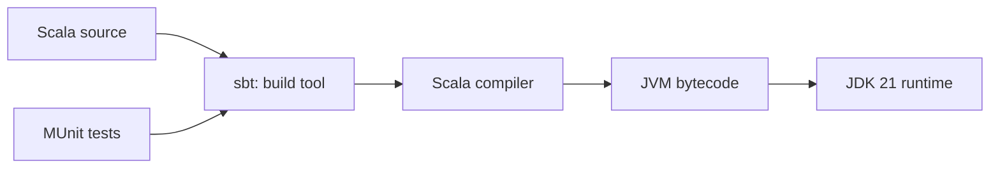

# Set Up the Scala Project

This chapter makes sure the project builds before DNS code is involved. The
small victory is a passing test that says `1 + 1 == 2`.

## What each tool does



- **JDK 21** runs sbt and the compiled program.
- **sbt** downloads dependencies, compiles source, and runs tests.
- **Scala 3** is the implementation language.
- **MUnit** provides readable tests.
- **ScalaCheck** generates inputs for protocol properties.
- **scalafmt** gives every source file one consistent layout.

## Verify the environment

```console
java -version
sbt --version
```

Then run the project:

```console
sbt test
```

The first run downloads dependencies and is slower. A successful run ends with
`Passed` and a zero exit code.

## Read the directory layout

```text
learn-dns/
├── build.sbt                 dependency and compiler settings
├── .scalafmt.conf            formatting rules
├── src/main/scala/dns/       implementation
├── src/test/scala/dns/       executable specifications
└── docs/                     this book
```

`main` contains code shipped to users. `test` contains code used only while
verifying the project. Both use package `dns`, so tests can read package-visible
implementation details when a boundary genuinely needs direct testing.

As the project grows, feature modules will bring each implementation, its tests,
fixtures, and chapter snapshot closer together. We keep the standard source
scopes so sbt, Metals, and publishing tools understand them without custom
filters.

## Why warnings fail the build

The CI build adds `-Werror`. An unused value or suspicious expression is treated
as a failure. Protocol software benefits from this strictness: a value decoded
and then accidentally ignored may be a missing validation step rather than
harmless clutter.

Formatting is checked separately:

```console
sbt scalafmtCheckAll
```

To apply formatting locally:

```console
sbt scalafmtAll scalafmtSbt
```

## Checkpoint

You are ready when both commands succeed:

```console
sbt scalafmtCheckAll
sbt test
```

The next chapter explains the runnable milestones. After that, we stop preparing
and decode our first DNS header.

