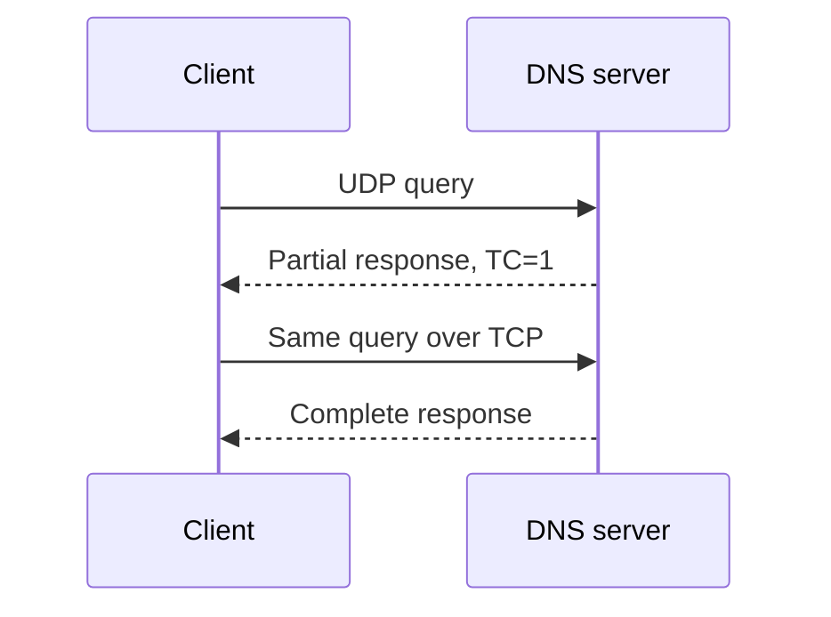
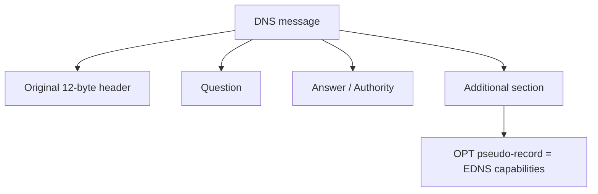
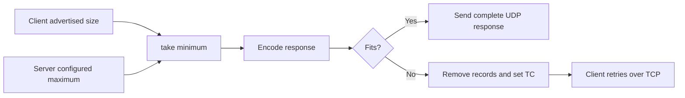

# Make Room with EDNS

Early DNS assumed that a UDP response would fit in 512 bytes. That is enough for
many address answers, but not for large RRsets, modern options, or DNSSEC data.
EDNS extends DNS without replacing the original 12-byte header.

By the end of this chapter, you will understand:

- why EDNS is represented as a strange “record” rather than new header fields;
- how a client advertises its UDP receive size;
- where extended response codes, version, and the DNSSEC OK bit are stored;
- why unknown options must survive decoding;
- how a server chooses between a UDP response and TCP fallback.

## The original size problem

Without EDNS, a server must assume the client can receive only 512 UDP bytes.
When an answer does not fit, the server removes records, sets the TC (truncated)
flag, and the client retries over TCP.



TCP fallback is correct, but using it for every moderately large response costs
another connection and round trip. A client needs a way to say, “I can safely
receive a larger UDP datagram.”

## Extend the message without changing the header

Changing the fixed header would break old implementations. EDNS instead adds an
OPT **pseudo-record** to the additional section.

“Pseudo” means it uses the resource-record layout but does not describe stored
DNS zone data. You cannot meaningfully ask for the OPT record of `example.com`.



This compatibility pattern is the central idea of
[RFC 6891](https://www.rfc-editor.org/rfc/rfc6891).

## Reuse the record fields

An ordinary resource record has owner, type, class, TTL, and RDATA. OPT assigns
new meanings to those positions:

| RR field | OPT meaning |
|---|---|
| owner name | root (`.`) |
| type | `OPT` (41) |
| class | maximum UDP payload size |
| TTL high byte | extended response code |
| TTL next byte | EDNS version |
| TTL low 16 bits | EDNS flags, including DO |
| RDATA | sequence of options |

```text
                 32-bit field occupying the old TTL position
       +----------------+---------+--------------------------+
       | extended RCODE | version | flags                    |
       | 8 bits         | 8 bits  | 16 bits                  |
       +----------------+---------+--------------------------+
                                      |
                                      +-- bit 15: DNSSEC OK
```

Using `ttl` for this field in the generic `ResourceRecord` is awkward, so the
public `Edns` type provides a structured view:

```scala
val edns = Edns(
  udpPayloadSize = 1232,
  version = 0,
  dnssecOk = true
)

val pseudoRecord: ResourceRecord = edns.toRecord
```

`Edns.fromRecord` performs the reverse conversion and rejects an OPT record with
a non-root owner or impossible advertised size.

## Why 1232 is the client default

This project advertises 1232 bytes by default. The number is a conservative
modern choice intended to reduce IP fragmentation on common network paths. EDNS
permits values through 65535, but advertising a large buffer does not guarantee
the network can transport a datagram of that size reliably.

The value is a capacity, not a request to pad every response to that length.

## Negotiate the actual response limit

The client advertises a size. The server also has an operational maximum. The
response must fit the smaller value:

```text
client advertises:       700 bytes
server maximum:         1400 bytes
UDP response limit:      700 bytes
```



Without an OPT record, the client did not negotiate EDNS. `DnsServer` therefore
uses the legacy 512-byte ceiling even when its configured maximum is larger.

## Encode options without knowing every option

Each option is another length-prefixed value:

```text
  option code       option length       option data
+----------------+----------------+--------------------+
| 2 bytes        | 2 bytes        | length bytes       |
+----------------+----------------+--------------------+
```

The IANA registry can assign new option codes after this implementation is
published. A closed enum would turn every new option into a decoding failure.
`EdnsOption` therefore stores the numeric code and exact bytes:

```scala
EdnsOption(code = 65001, data = Vector(1, 2, 3))
```

Typed helpers for known options can be layered on top without weakening the
generic codec.

The decoder checks that each option length remains inside the enclosing OPT
RDLENGTH. It rejects this shape:

```text
OPT RDLENGTH says 4 bytes remain
option header consumes 4 bytes
option length claims 1 more byte  ← outside RDLENGTH
```

This is tested as `EDNS-OPTION-LENGTH`.

## Handle an unsupported EDNS version

Version zero is the EDNS version standardized today. A request using another
version receives BADVERS. BADVERS has numeric response code 16, which does not
fit in the original header's four-bit RCODE.

The response therefore contains:

```text
header RCODE:        0
OPT extended RCODE:  1
combined RCODE:      1 × 16 + 0 = 16 (BADVERS)
OPT version:         0 (highest version the server supports)
```

The socket integration test `EDNS-BADVERS` asserts every part of this response.

## Follow the implementation flow

For a normal EDNS request:

1. `DnsClient` appends `Edns(udpPayloadSize).toRecord`.
2. `MessageCodec` encodes the OPT record and option sequence.
3. `DnsServer` validates that at most one OPT record exists.
4. The server checks version zero.
5. The authoritative or resolver handler produces its ordinary answer.
6. The server appends its own OPT response.
7. UDP truncation uses the negotiated minimum size.
8. `DnsClient` retries over TCP when TC is set.

Keeping EDNS negotiation in the transport server means `Zone.answer` does not
need to understand UDP buffer sizes.

## Exercises

1. Disable EDNS in `DnsClient` and show that the server uses 512 bytes.
2. Advertise 700 bytes to a server configured for 1400 and observe TCP fallback.
3. Add two OPT records and assert FORMERR.
4. Change the request version to one and calculate the combined RCODE manually.
5. Create an unknown zero-length option and verify a round trip.

## Checkpoint

You should now be able to answer:

- Why is OPT called a pseudo-record?
- Which field advertises UDP payload size?
- Why does BADVERS need the OPT extended RCODE?
- Why should unknown option bytes be preserved?
- What limit applies when a query has no OPT record?

## Primary references

- [RFC 6891 §6.1.2 — OPT wire format](https://www.rfc-editor.org/rfc/rfc6891#section-6.1.2)
- [RFC 6891 §6.2.3 — OPT processing](https://www.rfc-editor.org/rfc/rfc6891#section-6.2.3)
- [RFC 6891 §6.2.5 — UDP payload size](https://www.rfc-editor.org/rfc/rfc6891#section-6.2.5)
- [RFC 6891 §6.1.3 — extended RCODE and flags](https://www.rfc-editor.org/rfc/rfc6891#section-6.1.3)
- [RFC 3225 — DNSSEC OK bit](https://www.rfc-editor.org/rfc/rfc3225)
- [IANA EDNS option registry](https://www.iana.org/assignments/dns-parameters/dns-parameters.xhtml#dns-parameters-11)

