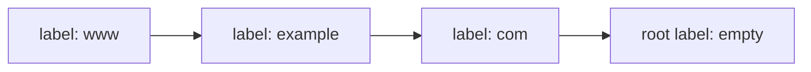
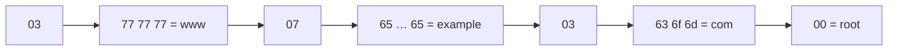
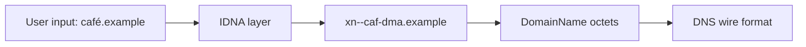
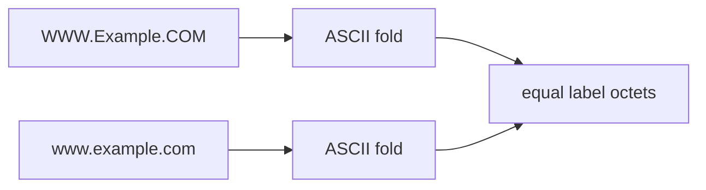
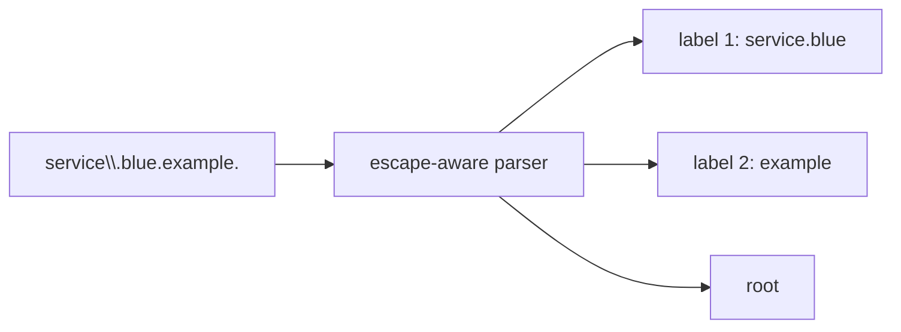
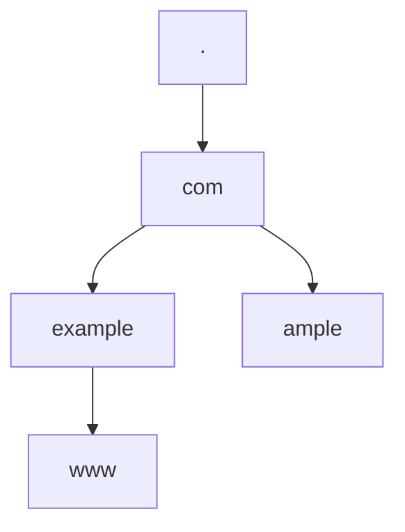

# Build a Domain Name from Labels

People write `www.example.com.` as one string. DNS does not store it that way.
It stores an ordered sequence of **labels**:



This chapter turns that idea into a type whose values already satisfy the DNS
length rules. Later codecs can trust `DomainName` instead of checking the same
invariants at every call site.

## A dot separates labels

In the usual **presentation form**, dots are separators:

```text
www . example . com .
 |       |       |   |
label   label   label root
```

The final dot is the root. Applications often hide it, so `DomainName.fromString`
accepts both `www.example.com` and `www.example.com.`. Both become the same
absolute DNS name.

An empty name and `.` represent the root itself.

## The wire format has no dot characters

On the network, each label is prefixed by its byte length. A zero length ends the
name:

```text
03 77 77 77 07 65 78 61 6d 70 6c 65 03 63 6f 6d 00
|  w  w  w  |  e  x  a  m  p  l  e  |  c  o  m  |
3 bytes     7 bytes                  3 bytes      root
```



`DomainName` stores labels as `Vector[Vector[Byte]]`. It does not store the dots
or the length prefixes. The codec adds those when writing a packet.

## Why labels are bytes instead of String

The base DNS protocol defines labels as octets. Unicode domain names are mapped
through IDNA before entering this protocol layer. Treating arbitrary JVM
`String` data as wire labels would mix two different responsibilities:



This project currently exposes the DNS octet/presentation boundary and rejects
raw non-ASCII characters. A future IDNA helper can be added without changing
wire equality or compression.

## Enforce the label limit

The first two bits of a normal label length are reserved. A label can therefore
occupy at most 63 octets.

```text
length byte: 00llllll
             ||||||
             6 length bits → values 0 through 63
```

`DomainName.fromLabels` rejects a 64-octet label with
`Error.LabelTooLong(64)`.

The complete uncompressed wire name is at most 255 octets. Its length is:

```text
1 final root byte + Σ(1 length byte + label bytes)
```

For `www.example.com.`:

```text
1 + (1 + 3) + (1 + 7) + (1 + 3) = 17 octets
```

The type calculates this as `wireLength` and rejects a value above 255 before it
reaches an encoder.

## Make invalid states unavailable

The constructor is private:

```scala
final class DomainName private (
  private val rawLabels: Vector[Vector[Byte]]
)
```

Callers use validated factories:

```scala
DomainName.fromString("www.example.com.")
DomainName.fromLabels(labels)
```

Both return `Either[DomainName.Error, DomainName]`. Code that has a `DomainName`
knows:

- no label is empty except the root terminator represented outside `labels`;
- every label is at most 63 octets;
- the complete wire name is at most 255 octets.

`unsafe` exists only for literals and test fixtures where failure is a source
code error.

## DNS comparison ignores ASCII letter case

`WWW.Example.COM.` and `www.example.com.` identify the same DNS name. Original
case may be useful when rendering a response, but comparison is ASCII
case-insensitive.



`equals` compares folded labels and `hashCode` hashes the same folded form. If
those methods used different rules, equal names could occupy different map keys
and break caching.

Only bytes `A` through `Z` are folded. This is not locale-sensitive lowercase;
Turkish or other language rules do not belong in DNS octet comparison.

## Escaped dots belong inside a label

Sometimes a label contains a literal dot byte. An unescaped dot would be read as
a separator, so presentation syntax uses a backslash:

```text
service\.blue.example.
```

The first label is `service.blue`, not two labels `service` and `blue`.



Splitting the input with `String.split(".")` cannot implement this rule. The
parser walks one character at a time and decides whether each dot is escaped.

## Decimal escapes represent arbitrary octets

A backslash followed by exactly three decimal digits represents one byte:

```text
a\000b\255.example.
```

The first label contains:

```text
61 00 62 ff
 a     b
```

Values above 255 produce `DecimalEscapeOutOfRange`. A final backslash produces
`TrailingEscape`.

When rendering, printable bytes are written directly except dot and backslash.
Non-printable bytes use three-digit decimal escapes. Therefore:

```scala
DomainName.fromString(name.toString) == Right(name)
```

holds even when labels contain zero, dot, backslash, or byte 255.

## Test subdomains by label boundary

`www.example.com.` is below `example.com.`. It is not below `ample.com.` even
though its rendered string contains those characters.



`isSubdomainOf` compares a suffix of label vectors, not a suffix of rendered
strings. Every name is a subdomain of the root.

This operation is security-sensitive in zone and bailiwick checks. String suffix
matching would confuse `notexample.com.` with `example.com.`.

## Move toward the root

`parent` removes the leftmost label:

```text
www.api.example.com. → api.example.com. → example.com. → com. → .
```

The resolver uses this path when looking for the closest delegation. The
authoritative server uses it to find the closest wildcard encloser.

## Read the tests as laws

Example tests cover named boundaries:

- root has a one-octet wire representation;
- 64-octet labels are rejected;
- 257-octet names are rejected;
- escaped dots stay in one label;
- decimal octets round trip;
- malformed escapes return typed errors.

Property tests generate many names and state broader laws:

- changing ASCII letter case preserves identity;
- every constructed name satisfies label and wire limits;
- encoding and decoding questions preserves the name.

## Exercises

1. Calculate the wire length of `api.example.test.` by hand.
2. Construct a 63-octet label and then make it fail with one extra byte.
3. Write a name whose first label contains both a dot and a backslash.
4. Explain why `endsWith("example.com.")` is not a valid subdomain check.
5. Add an IDNA adapter outside `DomainName` and keep the core octet model intact.

## Checkpoint

You should now be able to explain:

- the difference between a dot separator and a literal dot octet;
- why the model stores label bytes rather than a single string;
- where the 63- and 255-octet limits come from;
- why equality and hashCode must use the same case rule;
- why subdomain checks operate on label vectors.

## Primary references

- [RFC 1034 §3.1 — Name space](https://www.rfc-editor.org/rfc/rfc1034#section-3.1)
- [RFC 1035 §2.3.1 — Preferred name syntax](https://www.rfc-editor.org/rfc/rfc1035#section-2.3.1)
- [RFC 1035 §2.3.4 — Size limits](https://www.rfc-editor.org/rfc/rfc1035#section-2.3.4)
- [RFC 1035 §3.1 — Wire representation](https://www.rfc-editor.org/rfc/rfc1035#section-3.1)
- [RFC 1035 §5.1 — Master-file escapes](https://www.rfc-editor.org/rfc/rfc1035#section-5.1)
- [RFC 4343 — DNS case insensitivity](https://www.rfc-editor.org/rfc/rfc4343)
- [RFC 5890 — IDNA definitions](https://www.rfc-editor.org/rfc/rfc5890)
