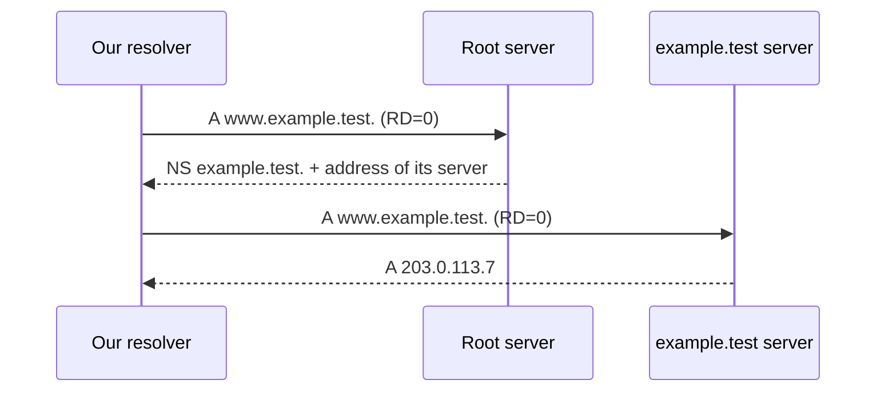
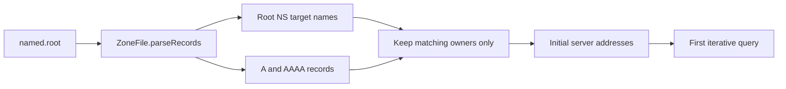
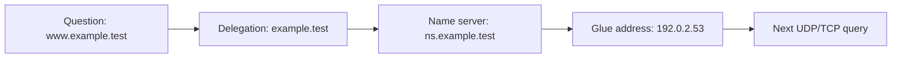
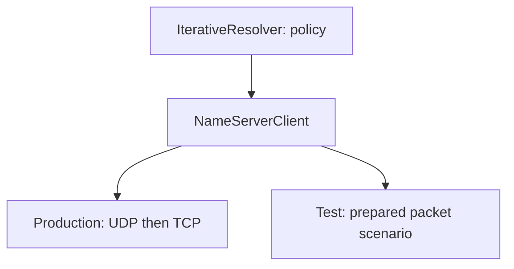
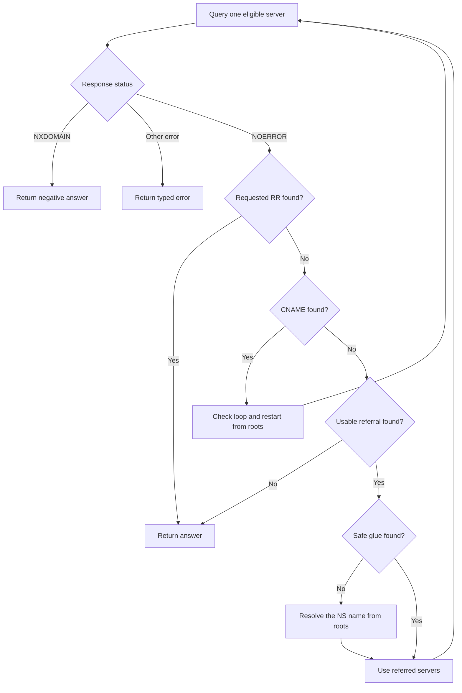
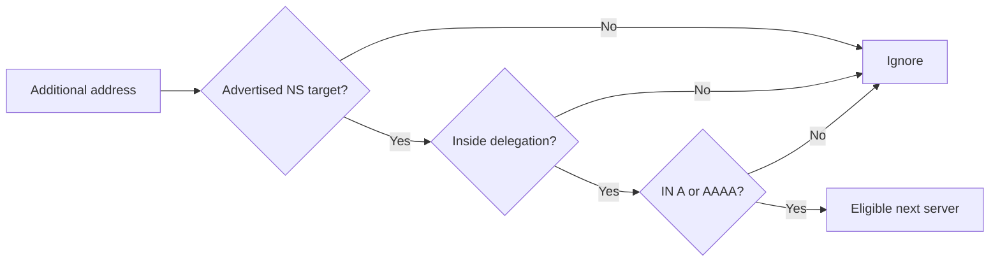

# Walk the DNS Tree Yourself

Until now, `DnsClient` has asked another resolver to do all the searching. An
**iterative resolver** does the search itself. It begins with known root-server
addresses, reads referrals, and moves toward the server that owns the answer.

This chapter assumes only the vocabulary from the introduction. We will define
each resolver-specific term before using it in code.

## The observable goal

We want this call:

```scala
resolver.resolve(Question(DomainName.unsafe("www.example.test."), RecordType.A))
```

to perform two simulated network exchanges:



`RD=0` means recursion is not requested. We are asking each server for the best
information it has, not asking it to finish the search for us.

## A referral is directions, not an answer

Suppose a root response contains:

```text
QUESTION
  www.example.test.  A

AUTHORITY
  example.test.      NS    ns.example.test.

ADDITIONAL
  ns.example.test.   A     192.0.2.53
```

The authority record says responsibility for `example.test.` belongs to
`ns.example.test.`. The additional record supplies an address so we can contact
that server. This address is called **glue**.

## Bootstrap from root hints

The hierarchy cannot tell us how to contact the root before we have contacted
the root. A **root hints file** breaks that circular dependency. It contains the
root NS RRset and address records for those advertised servers.



`RootHints` does not accept every address in the file. It first finds NS records
owned by the root, then keeps only A/AAAA records whose owner is one of those NS
targets. An unrelated address cannot silently become a bootstrap server.

Download the current file from InterNIC rather than compiling addresses into the
program:

```console
curl -o root.hints https://www.internic.net/domain/named.root
```

Then start the local recursive service:

```console
sbt 'runMain dns.cli.DnsRecurse --root-hints ./root.hints --port 5353'
```

Root hints are bootstrap data, not the root zone itself. Once running, the
resolver learns fresher root NS and address RRsets through normal DNS responses.
Operational software periodically refreshes the hints file and should review its
provenance before replacing trusted bootstrap data.



Neither record is the requested A record. The resolver must interpret them as
the next step.

## Separate policy from network I/O

Tests should not depend on public DNS servers or Internet access. We define one
small effect boundary:

```scala
trait NameServerClient:
  def query(
      server: InetSocketAddress,
      question: Question
  ): Either[DnsClient.Error, Message]
```

The production implementation uses `DnsClient`. Tests provide a scenario that
returns prepared messages and records which servers were visited.



This is more than test convenience. Resolver policy decides what data to trust;
transport decides how bytes reach a peer. Mixing the two makes both harder to
audit.

## Represent the walk as state

One recursive call carries all progress:

| State field | Why it exists |
|---|---|
| `question` | current name and type, which may change after CNAME |
| `servers` | addresses eligible for the next attempt |
| `aliases` | CNAME records already followed |
| `visitedNames` | detects a CNAME loop |
| `visitedDelegations` | detects a referral loop |
| `queries` | enforces a global network budget |
| `referrals` | limits delegation depth separately |

The decision tree is:



Every backward arrow has a counter or visited set. Untrusted servers cannot keep
the resolver in an infinite loop.

## Choose the closest referral

A response may contain several NS owners. We only consider owners that are
ancestors of the question. Among those, the owner with the most labels is the
closest delegation.

For `www.api.example.test.`:

```text
test.               ancestor, 1 label
example.test.       ancestor, 2 labels
api.example.test.   ancestor, 3 labels ← closest
attacker.test.      not an ancestor
```

This is implemented by grouping NS records by owner, filtering with
`questionName.isSubdomainOf(owner)`, and sorting by descending label count.

## Bailiwick: decide which glue is safe to use

**Bailiwick** means the part of the namespace for which a server's information
is relevant. Additional records are hints, not automatically trusted answers.

Consider a referral for `example.test.`:

```text
example.test.         NS ns.example.test.
ns.example.test.      A  192.0.2.53       accepted
ns.attacker.invalid.  A  192.0.2.66       ignored
```

Our milestone accepts glue only when:

1. the additional owner is one of the advertised NS targets;
2. that target is inside the delegated domain;
3. the record type is A or AAAA;
4. the class is IN.



Ignoring unrelated additional records is a basic defense against cache
poisoning. A complete resolver can resolve an out-of-bailiwick NS name through a
separate lookup; it must not pretend the unrelated glue is authoritative.

## Follow CNAME without losing the chain

A CNAME says the queried owner is an alias:

```text
www.example.test.    CNAME  service.example.net.
service.example.net. A      203.0.113.8
```

The resolver changes the current question name, restarts from roots, and keeps
the CNAME so the final caller sees the entire chain.

Two protections are required:

- `visitedNames` rejects `a → b → a`;
- `maxCnameDepth` bounds a long chain of unique aliases.

These protect against different attacks, so one is not a substitute for the
other.

## Read the declarative scenarios

`IterativeResolverSuite` describes network behavior as ordered pairs:

```scala
val scenario = Scenario(
  root        -> referral,
  childServer -> finalAnswer
)
```

The assertion checks both result and route:

```scala
assertEquals(scenario.visited, Vector(root, childServer))
```

Other scenarios state security properties in their names:

- `ITERATIVE-BAILIWICK` ignores unrelated additional addresses;
- `ITERATIVE-MISSING-GLUE` refuses unsafe glue;
- `ITERATIVE-CNAME` preserves the alias chain;
- `ITERATIVE-CNAME-LOOP` terminates repeated aliases.

## Resolve a name server when glue is missing

Some valid delegations use name servers outside the delegated domain:

```text
example.test. NS ns.provider.invalid.
```

The parent cannot authoritatively provide glue for `provider.invalid.`. The
resolver therefore launches a subsidiary A lookup for that NS name from the
roots. This subsidiary lookup shares the original query and referral budgets;
starting new counters would let nested referrals bypass the limits.

`resolvingNameServers` records every NS name currently being resolved. If two
delegations depend on one another, the resolver returns
`NameServerDependencyLoop` rather than recursing forever. When the subsidiary
lookup produces no usable address, it returns the typed `MissingGlue` error.

The current subsidiary lookup asks for A records. A later milestone will query
AAAA as well and combine both address families according to transport policy.

## Exercises

1. Add a scenario where the first of two root servers times out.
2. Add an AAAA glue scenario.
3. Construct a referral loop and assert `ReferralLoop`.
4. Set `maxCnameDepth` to one and create two unique aliases.
5. Explain why accepting every additional A record would be unsafe.

## Checkpoint

You should now be able to explain:

- why iterative queries clear RD;
- how a referral differs from an answer;
- what glue makes possible;
- why bailiwick is a trust decision;
- why both visited sets and numeric budgets are needed.

## Primary references

- [RFC 1034 §4.3.2 — Server algorithm](https://www.rfc-editor.org/rfc/rfc1034#section-4.3.2)
- [RFC 1034 §5.3.3 — Resolver algorithm](https://www.rfc-editor.org/rfc/rfc1034#section-5.3.3)
- [RFC 1034 §5.3.5 — Resolver failures](https://www.rfc-editor.org/rfc/rfc1034#section-5.3.5)
- [RFC 2181 §5 — RRsets](https://www.rfc-editor.org/rfc/rfc2181#section-5)
- [RFC  bailiwick clarification, RFC 8499 §5](https://www.rfc-editor.org/rfc/rfc8499#section-5)
- [InterNIC root hints](https://www.internic.net/domain/named.root)
