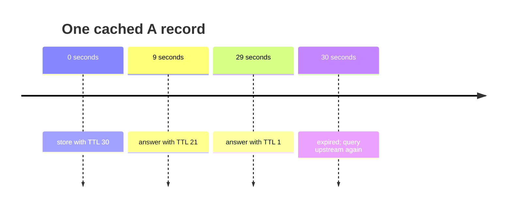
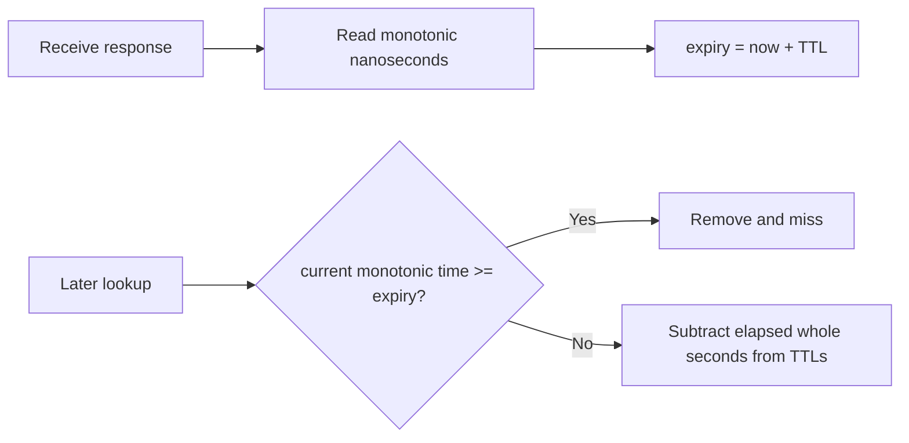
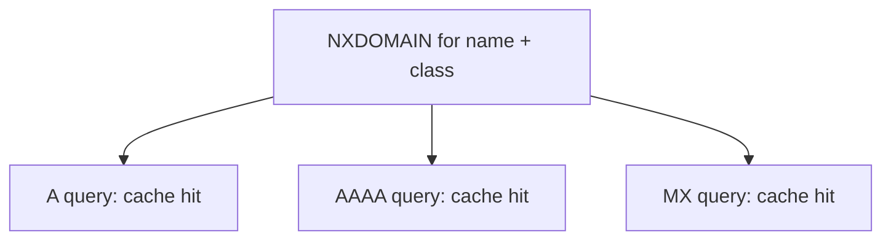
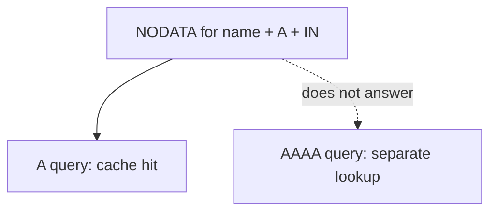
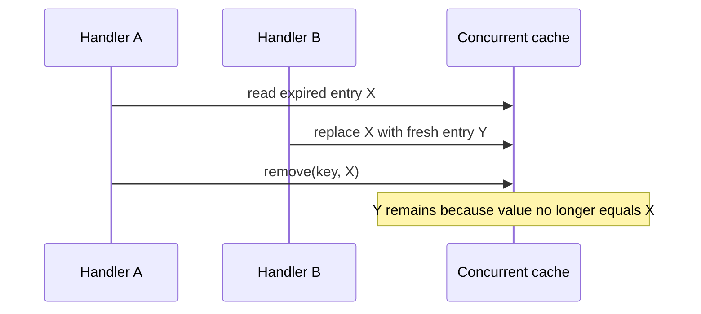
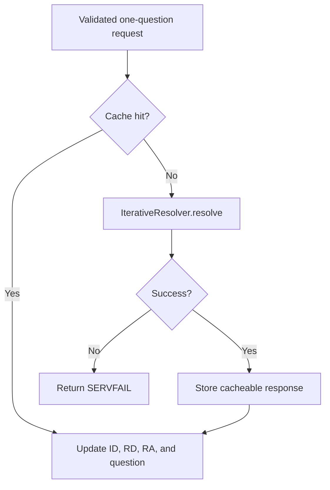

# Remember Answers Without Lying

A recursive resolver would be slow and wasteful if every question started at a
root server. DNS therefore makes caching part of the protocol. Every record says
how many seconds it may be reused.

Caching sounds like a map from question to response. The difficult parts are
time, negative answers, and deciding what one cache key means.

## Begin with one positive answer

Suppose the resolver receives:

```text
www.example.test.  30  IN  A  192.0.2.80
```

The TTL is 30 seconds. If a client asks nine seconds later, the cached response
must say approximately 21, not 30.



Resetting the TTL on every cache hit would make old data live forever.

## Use monotonic time

Wall clocks can jump when the system synchronizes time or an administrator
changes it. Cache expiry needs elapsed duration, not a calendar timestamp.



`Ticker` is a tiny time boundary. Production uses `System.nanoTime`; tests use a
manual counter and jump directly to one nanosecond before or exactly at expiry.

## Cache an RRset as one unit

An **RRset** contains records with the same owner, type, and class. Servers are
expected to return an RRset together. If records in a positive response have
different TTLs, this implementation expires the message at the smallest answer
TTL so it never serves a member beyond its lifetime.

```text
address 1 TTL: 30
address 2 TTL: 10
cache lifetime: 10 seconds
```

The current cache stores a complete response message. A more advanced resolver
stores independently reusable RRsets so referrals, aliases, and address data can
be combined across queries. That upgrade remains visible in the coverage
contract rather than being hidden behind the word “cache.”

## Negative answers also have TTLs

Two empty-looking responses mean different things:

| Result | Meaning |
|---|---|
| NXDOMAIN | the owner name does not exist |
| NODATA | the owner exists but not with the requested type |

An authoritative negative response includes the zone's SOA. RFC 2308 defines
the negative lifetime as the smaller of:

- the SOA record's TTL;
- the SOA MINIMUM field.

```text
SOA TTL:       600 seconds
SOA MINIMUM:   120 seconds
negative TTL:  min(600, 120) = 120 seconds
```

The cached SOA TTL is normalized to 120 before storage. At second 119 it is
served as 1, not 481. The entry disappears at second 120.

## NXDOMAIN and NODATA need different keys

Assume an A query for `missing.example.test.` returns NXDOMAIN. Asking for AAAA
at the same name cannot succeed: the response denied the entire name.



NXDOMAIN is therefore keyed by name and class.

NODATA is different. An A record can be absent while an AAAA record exists:



NODATA uses the full question: name, type, and class. `CacheSuite` states both
rules as separate executable tests.

## Do not cache every response

The cache accepts:

- positive NOERROR answers with at least one answer record;
- NOERROR negative answers containing an SOA;
- NXDOMAIN answers containing an SOA.

It rejects zero-TTL data and transient failures such as SERVFAIL. Caching a
SERVFAIL would turn a short upstream problem into a self-created outage.

## Bound memory

TTL bounds time but not the number of different names a client can request. An
attacker can generate an endless stream of unique names. `maxEntries` limits the
map size.

When inserting into a full cache, the current policy removes the entry with the
earliest expiry:

```text
entry A expires in 10s  ← evicted
entry B expires in 30s
new C expires in 20s
```

This O(n) scan is deliberately simple and deterministic for an educational
cache. A high-throughput resolver uses a segmented or approximate eviction data
structure so insertion does not scan every entry.

## Handle concurrent access

UDP and TCP handlers run concurrently on virtual threads. `ConcurrentHashMap`
provides thread-safe entry access. Expiry removal uses the `(key, entry)` form so
one thread does not remove a newer replacement inserted by another thread.



## Connect cache to recursive service

`RecursiveService` performs the message-level flow:



Transaction IDs are never part of cached identity. A cache hit is adapted to the
current client's ID and recursion-desired bit before it is returned.

## Exercises

1. Advance `ManualTicker` to one nanosecond before and exactly at expiry.
2. Store NXDOMAIN for A and retrieve it through an AAAA question.
3. Repeat the previous exercise with NODATA and explain the miss.
4. Insert three entries into a capacity-two cache with different TTLs.
5. Explain why `System.currentTimeMillis` is weaker than a monotonic ticker here.

## Checkpoint

You should now be able to explain:

- why served TTLs decrease;
- why the smallest answer TTL controls this message cache;
- how the SOA determines negative lifetime;
- why NXDOMAIN and NODATA use different keys;
- why TTL alone does not bound memory.

## Primary references

- [RFC 1034 §4.3.4 — Caching](https://www.rfc-editor.org/rfc/rfc1034#section-4.3.4)
- [RFC 1035 §3.2.1 — TTL](https://www.rfc-editor.org/rfc/rfc1035#section-3.2.1)
- [RFC 2181 §5 — RRsets](https://www.rfc-editor.org/rfc/rfc2181#section-5)
- [RFC 2308 §3 — Negative answers](https://www.rfc-editor.org/rfc/rfc2308#section-3)
- [RFC 2308 §5 — Negative caching](https://www.rfc-editor.org/rfc/rfc2308#section-5)

