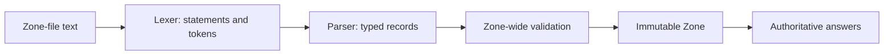
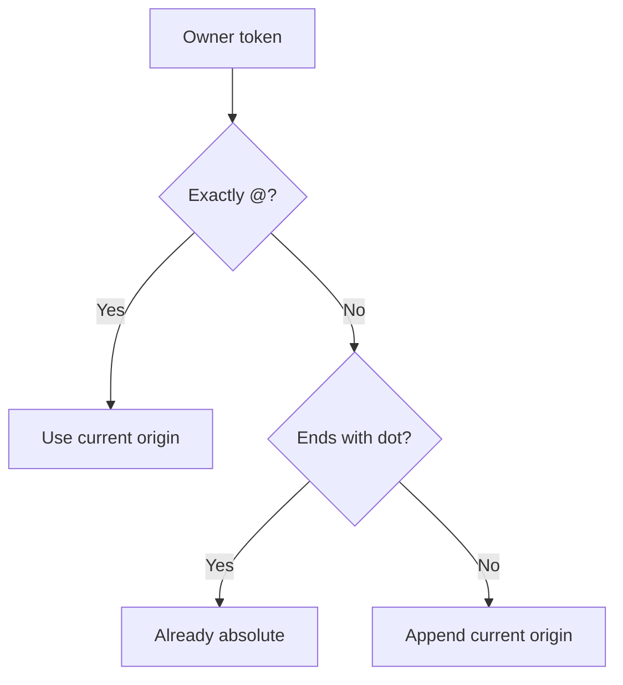
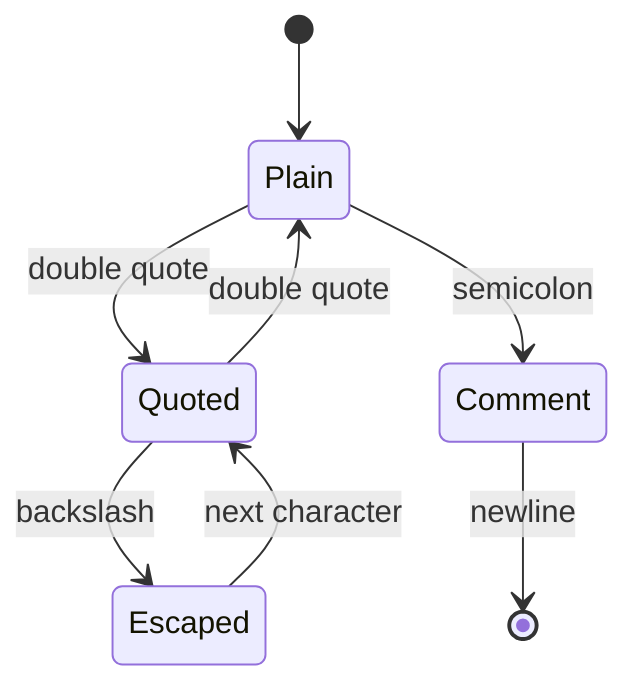
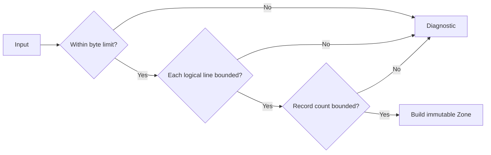

# Turn a Text File into a Zone

Hard-coding `ResourceRecord` values is useful in tests, but an authoritative
server needs to load operational data. DNS master files—usually called **zone
files**—are the traditional text format for that data.

This chapter starts with a five-line zone and follows it through lexing, parsing,
name expansion, record construction, and whole-zone validation.

## The smallest useful zone

```zone
$ORIGIN example.test.
$TTL 1h
@ SOA ns hostmaster 1 1h 15m 1w 5m
@ NS  ns
ns A 192.0.2.53
```

In plain language:

- this file describes `example.test.`;
- records default to a one-hour TTL;
- `ns.example.test.` is the primary server;
- `hostmaster@example.test.` is the administrative mailbox;
- the name server can be reached at `192.0.2.53`.

The SOA fields are explained later in this chapter. First, notice how little of
the file is written as a complete absolute name.

## Presentation syntax is not wire syntax

The wire codec reads length-prefixed labels and integers. A zone file is a human
presentation format with comments, whitespace, quotes, relative names, and time
units.



Keeping the lexer separate from record parsing prevents every RR implementation
from inventing its own quote and comment rules.

## Expand relative names

`$ORIGIN` supplies the suffix for names without a final dot:

| Written token | Expanded name |
|---|---|
| `www` | `www.example.test.` |
| `mail.service` | `mail.service.example.test.` |
| `absolute.example.` | `absolute.example.` |
| `@` | `example.test.` |



The final dot is therefore semantic, not decorative.

## Reuse the previous owner

A physical line beginning with whitespace omits its owner and reuses the owner
from the preceding record:

```zone
www  A     192.0.2.80
     AAAA  2001:db8::80
```

Both records belong to `www.example.test.`. This is why the lexical statement
retains `ownerOmitted`; tokenization alone would lose the leading whitespace.

Omitting the owner before any record is an error. The parser returns a diagnostic
instead of guessing `@`.

## Remove comments without damaging quoted text

A semicolon begins a comment except inside a quoted string:

```zone
message TXT "keep;this" ; discard this comment
```

The lexer tracks whether it is inside quotes and whether the previous character
was a backslash.



This small state machine prevents `"keep;this"` from being cut in half.

## Join parenthesized records

SOA records are commonly formatted across lines:

```zone
@ SOA ns hostmaster (
  2026071201 ; serial
  1h         ; refresh
  15m        ; retry
  1w         ; expire
  5m         ; negative cache TTL
)
```

Newlines inside balanced parentheses behave like spaces. `ZoneFileSyntax`
collects physical lines into one **logical statement**, while retaining the
first physical line for diagnostics.

Unmatched closing parentheses and an unfinished group at end-of-file are lexical
errors. The parser never sees a partially assembled SOA.

## Parse TTL units safely

TTL values can use `w`, `d`, `h`, `m`, and `s` suffixes:

```text
1h      = 3600 seconds
15m     = 900 seconds
1w2d    = 777600 seconds
```

The parser multiplies and adds with exact arithmetic, then checks the unsigned
32-bit DNS range. A huge value becomes a diagnostic rather than overflowing into
a small positive TTL.

`$TTL` sets the default. A record may override it:

```zone
$TTL 1h
www 5m A 192.0.2.80
```

## Parse each RDATA shape explicitly

After owner, optional TTL, optional `IN`, and type, each record has a specific
grammar:

| Type | Remaining fields |
|---|---|
| A | IPv4 address |
| AAAA | IPv6 address |
| NS | name-server name |
| CNAME | canonical target name |
| PTR | target name |
| MX | preference, exchange name |
| TXT | one or more strings |
| SRV | priority, weight, port, target |
| SOA | two names and five unsigned timers |

The parser checks exact field counts and integer ranges before constructing
`RecordData`. Unsupported types produce a diagnostic containing the original
logical line.

## Decode quoted escapes

A backslash quotes punctuation. Three decimal digits encode one byte value:

```zone
escaped TXT "semi\;colon" "A\066C"
```

The resulting chunks are `semi;colon` and `ABC`. Decimal values above 255 are
rejected at the lexical boundary.

## Accumulate independent diagnostics

Stopping at the first bad record makes correcting a large zone frustrating.
`ZoneFile.parse` continues after record-level failures:

```text
line 12: invalid IPv4 address: 999.2.3.4
line 19: unsupported record type: UNKNOWN
line 27: SRV expects 4 values
```

It returns `Either[Vector[Diagnostic], Zone]`: either every diagnostic or one
fully validated zone. A partially valid zone is never served.

Lexical corruption that prevents statement boundaries—such as an unterminated
quote—is reported before record parsing.

## Bound resource use

Zone files are local configuration, but they may still be generated or supplied
by automation. The parser limits:

- total UTF-8 input bytes;
- one logical statement's length;
- total accepted records.



These limits keep a configuration error from becoming an uncontrolled memory
allocation at server startup.

## Validate the zone as a whole

Parsing one record does not prove the records form a valid zone. After parsing,
`Zone.create` verifies:

1. an SOA exists at the requested zone origin;
2. every owner lies at or below that origin;
3. every record uses the Internet class;
4. the SOA record has the correct data shape.

The server receives a `Zone`, never an unvalidated record vector. This makes the
query path smaller and removes configuration checks from every request.

## Current deliberate boundaries

The parser implements the common RFC 1035 master-file subset needed by this
server. `$INCLUDE` needs an explicit file-loading capability and cycle policy;
it is not silently read from the process working directory. `$GENERATE` is a
BIND extension rather than RFC 1035 syntax and is also not accepted.

The future file-based API will inject an include loader, allowed root directory,
maximum include depth, and visited-path set. Those security decisions do not
belong in the string parser.

## Exercises

1. Remove `$TTL` and observe the diagnostic on the first record.
2. Add a record with an absolute out-of-zone owner.
3. Put a semicolon inside and outside a quoted TXT string.
4. Write an SOA across five physical lines, then remove the closing parenthesis.
5. Set `maxRecords` to two and load the minimal zone.

## Checkpoint

You should now be able to explain:

- why leading whitespace must survive lexing;
- how `$ORIGIN`, `@`, and the final dot interact;
- why comments require quote-aware scanning;
- why a successful record parse is not enough to construct a zone;
- why parser errors are accumulated but partial zones are not returned.

## Primary references

- [RFC 1035 §5 — Master files](https://www.rfc-editor.org/rfc/rfc1035#section-5)
- [RFC 1035 §3.3.13 — SOA](https://www.rfc-editor.org/rfc/rfc1035#section-3.3.13)
- [RFC 2308 §4 — SOA in negative answers](https://www.rfc-editor.org/rfc/rfc2308#section-4)
- [RFC 4343 — DNS case insensitivity](https://www.rfc-editor.org/rfc/rfc4343)

