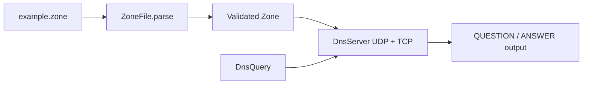
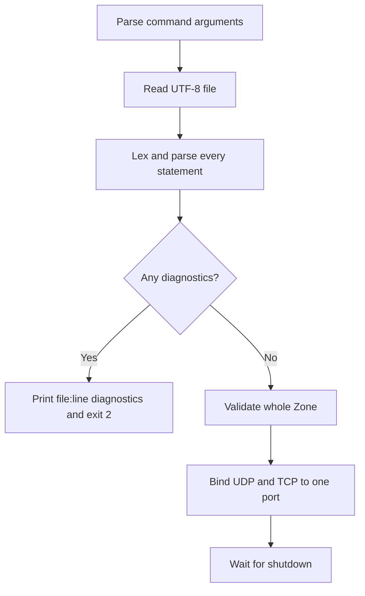
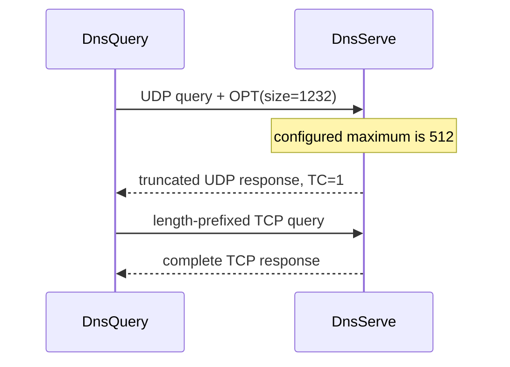

# Run the Server and Query It

The implementation is now connected end to end: a master file becomes a
validated `Zone`, `DnsServer` exposes it over UDP and TCP, and `DnsQuery` prints
the response. This chapter runs the entire path on the loopback interface.

## What we are building



The loopback interface keeps the experiment on your computer. No public DNS
configuration is changed.

## Create a zone file

Save this as `example.zone` in the repository root:

```zone
$ORIGIN example.test.
$TTL 1h

@ SOA ns1 hostmaster (
  2026071201
  1h
  15m
  1w
  5m
)

@     NS    ns1
ns1   A     127.0.0.1
www   A     192.0.2.80
www   AAAA  2001:db8::80
alias CNAME www
text  TXT   "hello from learn-dns"
```

`.test` is reserved for testing, so this zone does not collide with a public
Internet domain.

## Start the authoritative server

Use an unprivileged port so administrator access is unnecessary:

```console
sbt 'runMain dns.cli.DnsServe ./example.zone example.test. --port 5353'
```

Expected startup output resembles:

```text
serving example.test. on localhost:5353
```

The command performs all startup work before binding:



A malformed or partially valid zone is never served.

## Query the local server

In another terminal:

```console
sbt 'runMain dns.cli.DnsQuery www.example.test. A --server 127.0.0.1:5353'
```

The output is intentionally similar to `dig`:

```text
;; id: 12345, status: NOERROR, flags: qr aa rd
;; QUERY: 1, ANSWER: 1, AUTHORITY: 0, ADDITIONAL: 1

;; QUESTION SECTION:
www.example.test.  IN  A

;; ANSWER SECTION:
www.example.test.  3600  IN  A  192.0.2.80

;; ADDITIONAL SECTION:
.  0  Unknown(1232)  OPT  ; EDNS options:
```

The exact ID changes on every query. The OPT line is the EDNS negotiation from
the previous chapter, not zone data.

Try other types:

```console
sbt 'runMain dns.cli.DnsQuery www.example.test. AAAA --server 127.0.0.1:5353'
sbt 'runMain dns.cli.DnsQuery alias.example.test. A --server 127.0.0.1:5353'
sbt 'runMain dns.cli.DnsQuery text.example.test. TXT --server 127.0.0.1:5353'
```

## Compare NODATA and NXDOMAIN

The name `www.example.test.` exists, but it has no MX record:

```console
sbt 'runMain dns.cli.DnsQuery www.example.test. MX --server 127.0.0.1:5353'
```

This returns NOERROR with no answers and an SOA in the authority section. That
is NODATA.

Now ask for a missing name:

```console
sbt 'runMain dns.cli.DnsQuery missing.example.test. A --server 127.0.0.1:5353'
```

This returns NXDOMAIN with the SOA. The distinction tells caches whether one
type is absent or the entire name is absent.

## Observe UDP-to-TCP fallback

Start the server with the legacy-sized maximum:

```console
sbt 'runMain dns.cli.DnsServe ./large.zone example.test. --port 5353 --udp-size 512'
```

For a response larger than 512 bytes:



`DnsQuery` performs the retry automatically. `DnsServerSuite` runs this same
flow with real loopback sockets, so TCP fallback is not documented only by a
mock.

## Disable EDNS for comparison

```console
sbt 'runMain dns.cli.DnsQuery www.example.test. A --server 127.0.0.1:5353 --no-edns'
```

Without OPT, the server assumes a 512-byte UDP receiver. Small answers look the
same; large answers reach TCP sooner.

## Bind addresses and safety

The server defaults to the loopback address and port 5353. To bind a particular
local interface:

```console
sbt 'runMain dns.cli.DnsServe ./example.zone example.test. --bind 192.0.2.10 --port 5353'
```

Binding `0.0.0.0` or `::` exposes the service on every interface. Do not expose
an educational server to an untrusted network without rate limiting, privilege
separation, access policy, monitoring, and an operational security review.

Port 53 normally requires elevated privileges on Unix-like systems. Running the
entire JVM as root is not recommended. Production deployments use capabilities,
socket activation, containers, or a fronting service.

## Shutdown behavior

Press Ctrl-C. A JVM shutdown hook closes UDP and TCP sockets, stops accepting
work, waits briefly for active virtual-thread handlers, and then terminates any
remaining workers. `DnsServer.close` is idempotent, so tests and embedding
applications can use try/finally safely.

## Exit codes and diagnostics

The commands use conventional exit meanings:

| Exit | Meaning |
|---:|---|
| 0 | query printed successfully, or server stopped normally |
| 1 | network query failed |
| 2 | arguments, file reading, or zone validation failed |

Zone diagnostics include file and line:

```text
example.zone:12: invalid IPv4 address: 999.2.3.4
example.zone:19: unsupported record type: NAPTR
```

## Exercises

1. Add an MX record and query it.
2. Introduce two independent syntax errors and confirm both are printed.
3. Query through IPv6 loopback using `[::1]:5353`.
4. Advertise `--udp-size 700` and create a response just above that size.
5. Stop the server during repeated queries and observe typed client failures.

## Checkpoint

You should now be able to explain the complete path from a text line to a UDP or
TCP response, why startup rejects partial zones, and when a client retries over
TCP.

## Primary references

- [RFC 1035 §4.2 — Transport](https://www.rfc-editor.org/rfc/rfc1035#section-4.2)
- [RFC 1035 §5 — Master files](https://www.rfc-editor.org/rfc/rfc1035#section-5)
- [RFC 7766 — DNS over TCP requirements](https://www.rfc-editor.org/rfc/rfc7766)
- [RFC 6891 — EDNS](https://www.rfc-editor.org/rfc/rfc6891)
- [RFC 2606 §2 — Reserved test domains](https://www.rfc-editor.org/rfc/rfc2606#section-2)

