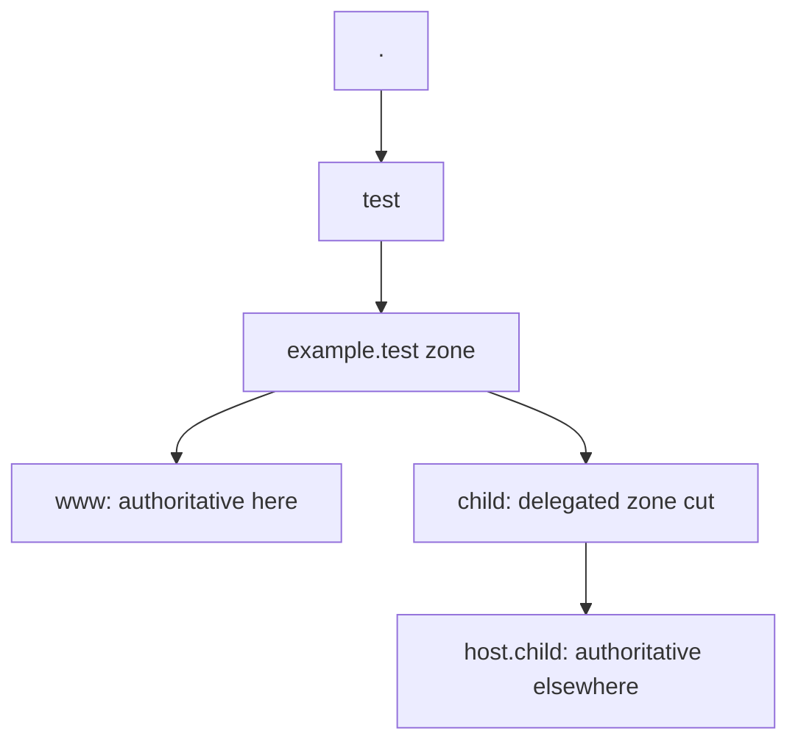
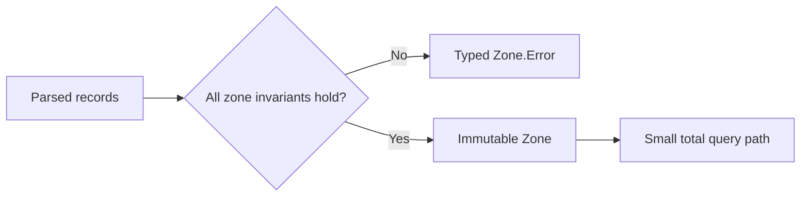
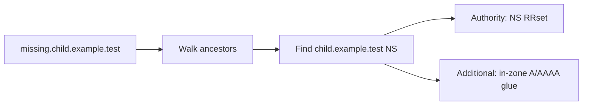
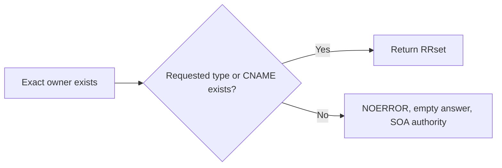
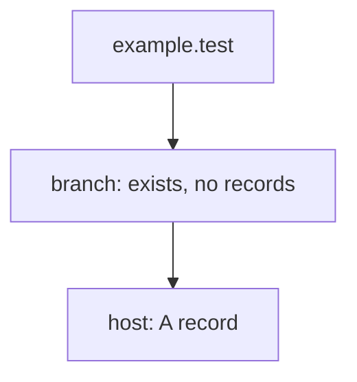
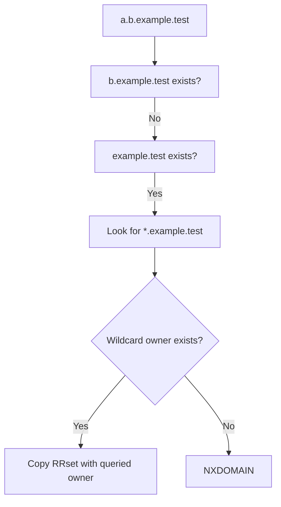

# Decide an Authoritative Answer

The wire codec tells us what a question says. The zone file tells us what data
we own. `Zone.answer` connects them by implementing the authoritative branches
of the DNS server algorithm.

This chapter focuses on decisions, not sockets. Every example is a pure
`Message => Message` transformation and can be tested without timing or network
access.

## What “authoritative” means

An authoritative server answers from a zone for which it is responsible. For
`example.test.`, it may own data for `www.example.test.` and delegate
`child.example.test.` to another server.



Authority is not “the server knows an answer.” A recursive cache may know an
answer without owning it. A parent zone may know where a child zone begins
without owning names below the cut.

## Validate before serving

`Zone.create` accepts an origin, one SOA, and records. It rejects the entire zone
when:

- the SOA owner differs from the origin;
- another SOA appears;
- a record owner lies outside the origin;
- a record uses a non-IN class;
- a CNAME owner also has another data type.



CNAME exclusivity is important. A name cannot simultaneously be an alias and
own ordinary A, MX, or TXT data. Enforcing this once is clearer than resolving a
contradiction during every query.

## Validate the request shape

The educational server accepts one Internet-class question. The first branches
are therefore:

```mermaid
flowchart TD
  request["Request"] --> count{"Exactly one question?"}
  count -->|No| formerr["FORMERR"]
  count -->|Yes| class{"Class IN?"}
  class -->|No| refused["REFUSED"]
  class -->|Yes| inside{"Name inside zone?"}
  inside -->|No| refused
  inside -->|Yes| algorithm["Run authoritative lookup"]
```

Processing only the first of multiple questions would be dangerous: the echoed
question section and answer policy would disagree about what was handled.

## Delegation is checked first

A non-apex NS RRset creates a **zone cut**. Questions at or below the cut receive
a referral, even if the parent has wildcard data that could otherwise match.

```zone
child  NS  ns.child
ns.child A 192.0.2.53
*.example.test. A 192.0.2.9
```

For `missing.child.example.test.`, the correct response is the child NS referral,
not the wildcard A record.



The AA flag is false on a referral because the response does not authoritatively
answer the original name and type.

## Exact owner and exact type

Without a zone cut, look for the exact owner. If the requested RRset exists,
return it with AA set:

```text
question: www.example.test. A
zone:     www.example.test. A 192.0.2.80
answer:   www.example.test. A 192.0.2.80
```

For ANY, the implementation returns all records at that owner. ANY behavior is
limited and often restricted on public servers; it is retained here to expose
the model rather than provide amplification-resistant production policy.

## CNAME answers another type of question

If the exact requested type is absent but the owner has CNAME, return the CNAME:

```text
question: alias.example.test. A
zone:     alias.example.test. CNAME www.example.test.
answer:   alias.example.test. CNAME www.example.test.
```

An authoritative server may also include the target answer when it is locally
available. This implementation returns the CNAME and lets the recursive resolver
continue, keeping the authoritative policy simple and explicit.

## NODATA: the name exists, the type does not

If `www.example.test.` has AAAA but no A, an A query is not NXDOMAIN. The name
exists.



The SOA gives recursive resolvers the negative caching parameters from RFC 2308.

## Empty non-terminals also exist

Suppose the zone contains `host.branch.example.test.` but no record directly at
`branch.example.test.`. The intermediate name is an **empty non-terminal**.



An A query for `branch.example.test.` returns NODATA. It must not use
`*.example.test.` because the queried name already exists in the DNS tree.

`existingNames` includes every record owner and its ancestors so this branch is
visible even though no record map entry exists at `branch`.

## NXDOMAIN: the owner does not exist

Only when the exact owner and every empty-non-terminal check fail do we consider
wildcards. If no wildcard applies, return NXDOMAIN plus SOA.

```text
RCODE:       NXDOMAIN
ANSWER:      empty
AUTHORITY:   zone SOA
AA:          true
```

NXDOMAIN denies the whole owner name, not only the requested type. This is why
the cache keys it differently from NODATA.

## Find the closest wildcard encloser

A wildcard owner begins with the literal label `*`. It does not perform arbitrary
string matching. The algorithm first finds the closest existing ancestor of the
missing name, then looks for `*` directly below that ancestor.



The wildcard's RDATA is preserved, but the response owner becomes the queried
name. For wildcard CNAME:

```text
zone owner:      *.example.test.
query owner:     alias.example.test.
response owner:  alias.example.test.
CNAME target:    unchanged
```

## Existing names block wildcards

Wildcard synthesis occurs only for a nonexistent owner. If an exact owner has
AAAA and the query asks for A, the result is NODATA; the wildcard A does not fill
the missing type.

This rule and empty-non-terminal blocking prevent surprising wildcard leakage
into names already defined by the zone.

## Assemble referrals with glue

The referral authority section contains the closest NS RRset. The additional
section includes A/AAAA records for those NS targets when the addresses are
inside the parent zone.

```text
AUTHORITY:
child.example.test. NS ns.child.example.test.

ADDITIONAL:
ns.child.example.test. A 192.0.2.53
```

Out-of-zone glue cannot be stored in this `Zone` because all owners are validated
under the origin. A recursive resolver resolves an external NS target separately.

## Map tests to algorithm branches

`ZoneSuite` names tests after the decision they prove:

| Test prefix | Branch |
|---|---|
| exact answer | requested RRset exists |
| NODATA / NXDOMAIN | negative distinction |
| `DELEGATION-CUT` | referral precedes wildcard |
| `WILDCARD-EMPTY-NON-TERMINAL` | existing empty name blocks synthesis |
| `WILDCARD-CNAME` | synthesized owner, preserved target |
| `WILDCARD-BLOCKING` | existing owner blocks missing-type synthesis |
| `QUESTION-COUNT` | request shape validation |
| `CNAME-EXCLUSIVITY` | zone construction invariant |
| `SOA-UNIQUENESS` | zone construction invariant |

## Exercises

1. Add two A records at one owner and verify the entire RRset is returned.
2. Put a wildcard below a delegated child and explain which zone owns it.
3. Create `x.y.example.test.` and query the empty non-terminal `y`.
4. Query an existing A owner for MX and compare it with a missing owner.
5. Add optional in-zone CNAME target completion without crossing a zone cut.

## Checkpoint

You should now be able to order the major branches:

1. validate request;
2. find a delegation;
3. find exact owner and type/CNAME;
4. return NODATA for an existing owner;
5. attempt closest-encloser wildcard synthesis;
6. return NXDOMAIN.

## Primary references

- [RFC 1034 §4.2 — Zones](https://www.rfc-editor.org/rfc/rfc1034#section-4.2)
- [RFC 1034 §4.3.2 — Authoritative server algorithm](https://www.rfc-editor.org/rfc/rfc1034#section-4.3.2)
- [RFC 1035 §3.2.1 — Resource records](https://www.rfc-editor.org/rfc/rfc1035#section-3.2.1)
- [RFC 2181 §5 — RRsets](https://www.rfc-editor.org/rfc/rfc2181#section-5)
- [RFC 2308 — Negative answers](https://www.rfc-editor.org/rfc/rfc2308)
- [RFC 4592 — Wildcards](https://www.rfc-editor.org/rfc/rfc4592)
